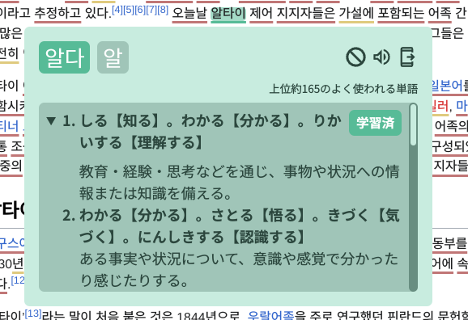

# Korean pop-up dictionary and study tool
This project consists of two parts: a rust backend with a REST API and postgres database, and a browser extension written using the Plasmo framework and React.

- Partial support for yomichan format of dictionaries (POC with KRDICT)
- Deinflection of verbs and adjectives using deinflection rules from [the Korean fork of yomichan](https://github.com/Lyroxide/yomichan-korean/blob/master/ext/data/deinflect.json)

## Features

- Hover Korean words while holding shift key to search for the word in KRDICT and display the result in a popup next to the word.
- Word frequency (learn the most common word first!)
- Automatically underline Korean words on a website with colors according to status, both on pageload and for new text that is inserted. This is useful in combination with a texthooker page such as [this one](https://renji-xd.github.io/texthooker-ui/) to be able to use it with local videos or games
- Keep track of word status (unknown, seen, known) or ignored
- Easy sentence mining by exporting flash cards to [Anki](https://apps.ankiweb.net/)

## Development
Start up the backend along with the browser extension by following the description [here](backend/README.md#development) and [here](browser-extension/README.md#getting-started)

## TODO

- sorting improvements:
  - prefer longer matches over frequency (compare number of jamo that match)
  - needs sorting improvement: 떠날, 한심한, 남자, 비싼, 이름은, 다리
- deinflection improvements: 
  - 여길, 고왔답니다 should only have 1 match, not 3
  - more than one deinflected pass to catch compound grammar rules e.g. 잃었는데
  - 화가 does not match 화, but might be too much noise if we match all substrings? maybe fix this one after we add % match?
- search improvements to remove noise: 야박하다 could exclude 야 if 3/4 match or something
- maybe try to incorporate grammar entries in krdict (headword contains loose jamo for some)
- mixed status (i.e a word matches several headwords where some are unknown, some are known, some are seen)
- ignore full words (not only per headword/dictionary match) (this probably requires new db table)

- allow looking up partial words by selecting text
  - or just search from mouse position in word to the end of the word like yomichan to easier search parts of words
- show name of deconjugations for inflected verbs and adjectives
- translate part-of-speech in the definition (currently it's in korean)
- implement the redesign
- settings page/settings in popup.tsx
  - toggle monitoring (for underlining words)
  - change language (japanese, english etc.)
  - change modifier key (shift) to something else or to nothing
- possibly merge definitions where the only difference is part of speech (e.g 형식적 has definition for noun and for adjective but they are almost the same)
- show number of stars based on CC100 frequency
  - display 初級, 中級 or 上級 instead of krdict stars to avoid confusion with frequency stars
- structuring hanja/reading/Pos fields in the popup
- merge known/seen/unknown to one button
- show if the word has been added to anki already (maybe store this in db to be able to show it even without ankiconnect running?)
- export flashcard without ankiconnect running and sync later
- detect 1T sentences
 - auto stop video playback when 1T is detected
- highlight common unknown words in a way
- count number of known/seen/unknown on webpage, display % comprehensibility
- display total number of known/seen 
- stats 
- can't parse '훤칠'이
- only have one button for anki export and a way to mark which entry should be used
- maybe hide 하다 variant of a word and just display a note on the base word about 하다?
- more detailed hanja info (requires graphical redesign)
- prompt if anki export is clicked with no text selected
- still show a popup with something for unmatched words (links to other sources or show results from external sources)
- introduce concept of % match, like for 한심한 we can be very sure it should only match 한심하다
- display number of times looked up
- integration tests

- doc for anki export
- motivation